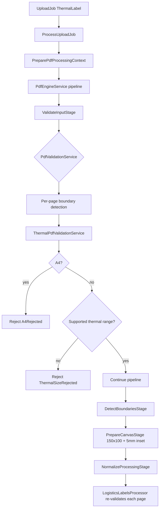
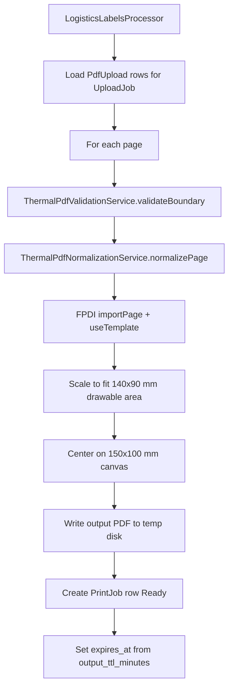

# Milestone 2 — Logistics Labels PDF Normalization Engine

**Module:** Merchant logistics labels only (V2.4 highest-priority M2 feature)  
**Date:** 2026-06-06  
**Status:** Implemented

---

## Supported sizes

Thermal courier labels in the **10×15 cm family** (short × long side, portrait or landscape):

| Dimension | Min (mm) | Max (mm) |
|-----------|----------|----------|
| Short side | 90 | 110 |
| Long side | 140 | 160 |

**Examples accepted:**

- 100 × 150 mm (portrait)
- 150 × 100 mm (landscape)
- 102 × 152 mm (within tolerance)

Configuration: `config/pdf.php` → `validation.thermal_*_mm`.

---

## Rejected sizes

| Category | Rule | Validation code | Localized message |
|----------|------|-----------------|-------------------|
| A4 | 210 × 297 mm (±3 mm portrait or landscape) | `a4_rejected` | `merchant.pdf.validation.a4_rejected` |
| Too small / too large | Outside thermal min/max on either side | `thermal_size_rejected` | `merchant.pdf.validation.thermal_size_rejected` (+ detail with page + dimensions) |
| Non-PDF / unreadable | Parse failure | `invalid_pdf` | `merchant.pdf.validation.invalid_pdf` |
| Oversized file | > `max_source_bytes` | `file_too_large` | `merchant.pdf.validation.file_too_large` |
| Too many pages | > `max_pages_per_job` | `page_limit_exceeded` | `merchant.pdf.validation.page_limit_exceeded` |

---

## Validation flow

**Reusable layer:** `ThermalPdfValidationService` implements `ThermalPdfValidationInterface`.  
**Framework layer:** `PdfValidationService` delegates thermal mode to per-page thermal validation.

---

## Normalization flow

**Output canvas:** 150 mm × 100 mm  
**Safe print area:** 5 mm inset on all sides (140 × 90 mm drawable)  
**Quality:** FPDI template import (vector barcodes / QR preserved — no rasterization)

**Reusable layer:** `ThermalPdfNormalizationService` implements `ThermalPdfNormalizationInterface`.  
**Orchestration:** `PdfNormalizationService` → `PdfProcessorRegistry` → `LogisticsLabelsProcessor`.

---

## Storage flow

| Path template | Config key | Purpose |
|---------------|------------|---------|
| `merchants/{merchant_id}/jobs/{job_id}/sources` | `pdf.paths.sources` | Raw uploads |
| `merchants/{merchant_id}/jobs/{job_id}/outputs` | `pdf.paths.outputs` | Normalized PDFs |
| Temp disk | `PDF_TEMP_DISK` (default `temp`) | Short-lived storage |

**Batch-ready:** One `PrintJob` per source page; processor loops all `PdfUpload` files and pages in a single job (future batch = multiple upload jobs queued).

---

## UI integration

| Surface | Component | Behavior |
|---------|-----------|----------|
| Logistics workspace list | `PrintJobListMapper` | Items keyed `print-job-{id}` |
| Preview pane | `LogisticsLabelsPreviewService::buildFromPrintJob()` | Dimensions, orientation, download link |
| Upload detail preview | `UploadPreviewService` | Uses first ready `PrintJob` when available |
| Download | `GET /printing/logistics-labels/print-jobs/{printJob}/download` | Authorized stream; marks `Downloaded` |

Sample list fallback remains when no uploads/print jobs exist.

---

## Queue & lifecycle

| Action / job | Role |
|--------------|------|
| `DispatchUploadProcessing` | Dispatched from `UploadService` for `ThermalLabel` uploads |
| `ProcessUploadJob` | Runs pipeline; sync in tests (`QUEUE_CONNECTION=sync`) |
| `MarkUploadProcessing` | `pending` → `processing` |
| `CompleteUploadProcessing` | `processing` → `completed` + audit |
| `FailUploadProcessing` | `processing` → `failed` + localized error |

---

## Localization

Keys added in `lang/en/merchant.php` and `lang/zh-TW/merchant.php`:

- `merchant.pdf.validation.thermal_size_rejected*`
- `merchant.pdf.orientation.*`
- `merchant.pdf.normalization.thermal_page_complete`, `logistics_complete`
- `merchant.print_jobs.status.*`, `actions.download`, `errors.*`
- `merchant.printing.preview.logistics_labels.processed.*`
- `merchant.printing.modules.logistics_labels.list.*`

---

## Tests

| Test | Coverage |
|------|----------|
| `ThermalPdfValidationServiceTest` | Accept thermal, reject A4, reject unsupported |
| `PdfEngineServiceTest` | Full pipeline creates `PrintJob` |
| `LogisticsLabelsProcessingTest` | Queue job, A4 rejection, download, workspace list |

Run: `php artisan test --filter=LogisticsLabels`

Full suite: **122 passed** (4 skipped) after implementation.

---

## Key files

| File | Purpose |
|------|---------|
| `app/Services/Merchant/Pdf/ThermalPdfValidationService.php` | Reusable validation |
| `app/Services/Merchant/Pdf/ThermalPdfNormalizationService.php` | Reusable normalization |
| `app/Services/Merchant/Pdf/Processors/LogisticsLabelsProcessor.php` | Module processor |
| `app/Jobs/Merchant/ProcessUploadJob.php` | Async/sync processing |
| `app/Models/PrintJob.php` | Normalized output records |
| `config/pdf.php` | Canvas, thresholds, processor binding |

---

## Not in scope (later M2 phases)

- Order PDF merge, picking list export, delivery label PDF
- Scheduled shredding (`storage:shred-expired`)
- Redis queue production deploy docs
